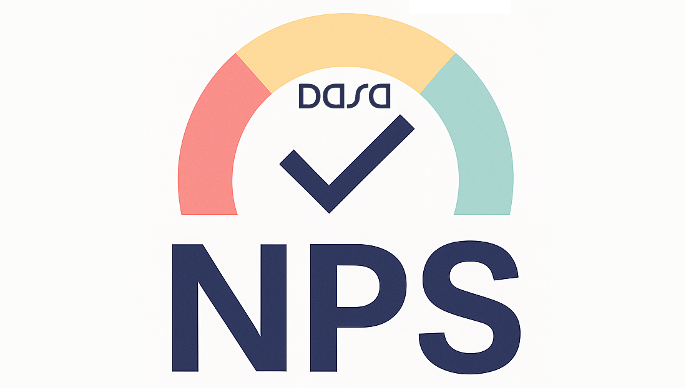
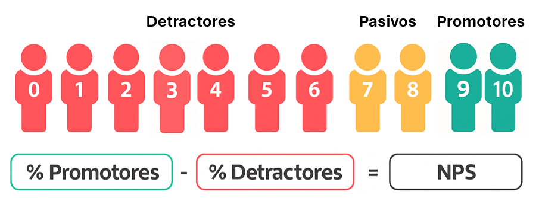
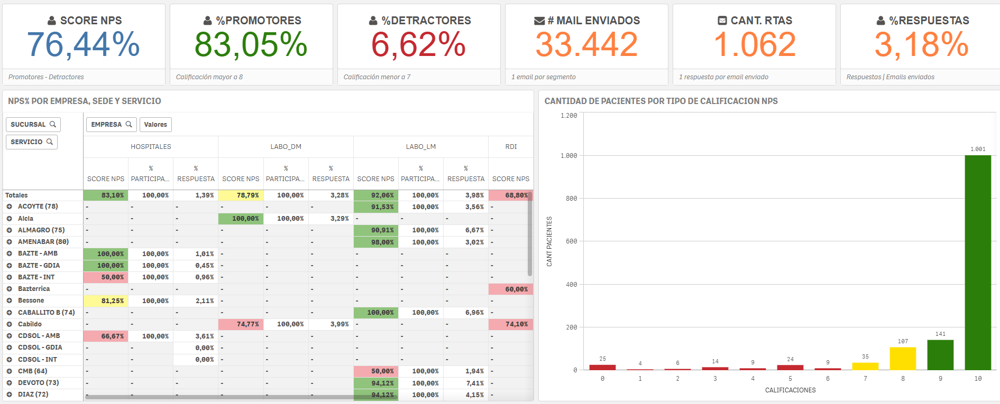

# 🎯 **Instructivo de Uso - Tablero NPS** 🚀

---

Este documento tiene como objetivo explicar la <u>estructura</u> y <u>funcionalidad</u> del tablero de Qlik para el seguimiento del <strong>Net Promoter Score (NPS)</strong>.

---

## 📌 ¿Qué es el NPS? 🤔

El **NPS** es un indicador que mide la lealtad de los clientes a partir de una única pregunta:

> "¿Qué tan probable es que recomiendes nuestra empresa o servicio a un amigo o colega?" 💬

## 📊 ¿Cómo se calcula el NPS?

> 💡 **¡Esta es la fórmula más importante del documento!**

🔷 **SCORE NPS = % Promotores (9-10) − % Detractores (0-6)**  
   
✨ Los Pasivos (7-8) no se cuentan en el cálculo.

---

## 🗂️ Estructura del Tablero

El tablero está dividido en **4 hojas** que te permiten analizar la evolución del NPS y los comentarios de los usuarios.

---

### 📄 Hoja 1: Encuesta de NPS

- 🏆 **KPIs principales (arriba):**  
  - NPS (Promotores - Detractores)  
  - % de Promotores  
  - % de Detractores  
  - Total de emails enviados por segmento  
  - Total de respuestas por segmento  
  - % de respuestas sobre el total enviado

- 📊 **Gráfico de barras:**  
  Muestra la cantidad de respuestas según el valor de calificación (1 a 10).

- 📋 **Tabla de Score NPS:**  
  Segmentado por tipo de negocio y sucursal, para analizar diferencias entre unidades.

---

### 📈 Hoja 2: Evolutivo

- ⏳ Permite analizar la evolución del NPS en el tiempo.  
- 🎛️ Filtros para seleccionar períodos, semanas u otras variables de calendario.

- 📑 **Resumen por periodo (mes cerrado):**  
  - Score NPS global del mes  
  - Cantidad de respuestas por rango (1-6, 7, 8, 9, 10) y sus porcentajes

- 🔢 **Matriz de score NPS:**  
  Score por servicio y sucursal para detectar variaciones internas.

---

### 📅 Hoja 3: Gráfico de Evolución NPS

- Visualiza la evolución diaria y mensual del indicador.

- 📉 Contiene **3 gráficos**:  
  1. Evolución diaria del NPS por empresa (RDI y Laboratorio) + NPS combinado  
  2. Evolución diaria global del NPS  
  3. Evolución del NPS por mes cerrado, según filtros seleccionados

- 🔍 Ideal para detectar patrones, tendencias y puntos de inflexión en la satisfacción.

---

### 💬 Hoja 4: Comentarios

- Muestra los comentarios de los encuestados.

- 🗃️ Tabla con:  
  - ID de ingreso  
  - Nombre paciente
  - Email  
  - Fecha de envío  
  - Sucursal  
  - Comentario

- 👆 Al hacer clic en un comentario, se amplía para facilitar la lectura.

- 🧹 Filtros para enfocar en comentarios según score, fechas u otras variables, ayudando a identificar oportunidades de mejora o felicitaciones.

---

*Creado por Equipo BI*
